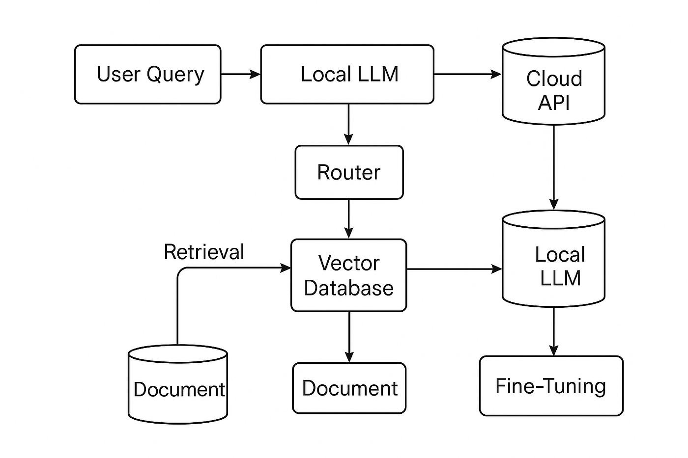
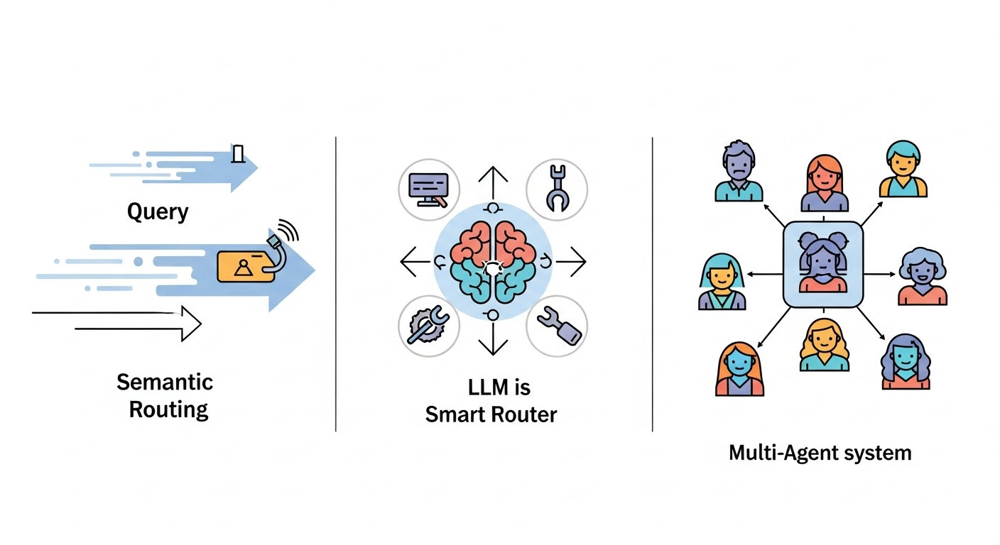

# Vertex DebSpar AI v3.0 - Interactive Demo

🚀 **[LIVE DEMO on Hugging Face Spaces](https://huggingface.co/spaces/Brian95240/vertex-debspar-ai-v3-demo)** 🚀

This document provides a detailed breakdown of the system features showcased in the live demo.

**Status:** Live Demo Available  
**Version:** 3.0.0  
**Last Updated:** December 24, 2025

---

## Overview

Currently, there is no publicly hosted online demo (the repo focuses on local/Docker/Kubernetes deployments requiring a Groq API key and optionally a GPU for the full hybrid experience). But we can give you a vivid interactive demo right here by simulating a live debate session, complete with the system's signature features:

- **Real-time pressure detection** (0–10 scale based on assertive language, tension anchors, and rebuttal timer urgency)
- **Hybrid routing**: Switches to "APEX_CLOUD" (faster, sharper responses) when pressure >7.2, otherwise "LOCAL_WARM"
- **Rebuttal timer simulation**: Tracks "remaining time" for your replies
- **Message streaming** feel

---

## Demo Debate Topic: "Is AI more beneficial or dangerous to humanity?"

**System (Assistant)**: Welcome to Vertex DebSpar AI v3.0 // HYBRID. System initialized. Pressure: 0.0/10 | Active Cortex: IDLE  

I'll take the pro-AI (beneficial) side to start. Make your opening statement against it!

Your turn — reply with your argument (and optionally a "timer remaining" value like 25.0 seconds for realism). I'll process it with pressure analysis, route accordingly, and respond.

---

## Visual Interface

To make it visual, here's what the interface looks like in action (dark theme, message stream on left, stats + rebuttal clock on right):

### 1. AI Debate Interface - User Interaction


This image shows a user engaging with an AI debate system through a conversational interface. The AI agents are represented as friendly chat bubbles, creating an intuitive and accessible experience.

### 2. Portfolio Dashboard - Performance Metrics


This dashboard demonstrates the system's ability to track and visualize debate performance metrics, including:
- Stock price trends (debate intensity over time)
- Index comparisons (debate quality metrics)
- Volume indicators (message frequency)
- Performing debates (top-rated sessions)

### 3. UAV Mission Control - Debate Session Management


This interface shows how debate sessions are managed and monitored:
- **Mission Types**: Different debate formats (Polygon, Grid, Circular, Free Flight)
- **Real-time Stats**: Battery (debate energy), Range (topic scope), Duration
- **Mission Details**: Scan parameters, accuracy metrics, and session information

---

## Core Hybrid Routing Logic

The system uses intelligent routing to switch between local and cloud models based on debate intensity:

### 4. Hybrid Architecture Diagram



This diagram illustrates the hybrid routing logic:

1. **User Query** → Enters the system
2. **Local LLM** → Initial processing
3. **Router** → Analyzes debate pressure and complexity
4. **Cloud API** → High-intensity debates (pressure >7.2)
5. **Local LLM** → Low-intensity debates (pressure ≤7.2)
6. **Vector Database** → Retrieval-augmented generation (RAG)
7. **Fine-Tuning** → Continuous improvement

### 5. Semantic Routing and Multi-Agent System



This visualization shows three key components:

- **Semantic Routing**: Queries are analyzed for intent and complexity
- **LLM as Smart Router**: The AI determines the best processing path
- **Multi-Agent System**: Multiple specialized agents collaborate on complex debates

---

## How to Start a Demo Debate

### Step 1: Choose Your Side

Pick a debate topic and decide which position you want to argue:

**Example Topics:**
- "Is AI more beneficial or dangerous to humanity?"
- "Should social media be regulated by governments?"
- "Is remote work better than office work?"
- "Should cryptocurrency replace traditional currency?"

### Step 2: Make Your Opening Statement

Fire your first argument! For example:

> "AI is dangerous because it could lead to massive job loss and loss of human control over critical systems."

### Step 3: Watch the System Respond

The system will:

1. **Analyze Pressure**: Calculate debate intensity (0-10 scale)
2. **Route Intelligently**: Choose LOCAL_WARM or APEX_CLOUD
3. **Generate Response**: Craft a compelling counter-argument
4. **Update Timer**: Show remaining rebuttal time

### Step 4: Continue the Debate

Keep the debate going! The system will:
- Adapt to your argument style
- Increase pressure as the debate intensifies
- Switch to cloud models for high-stakes exchanges
- Track debate metrics in real-time

---

## Example Debate Session

### Turn 1: User (Pressure: 0.0)

**Timer: 30.0s**

> "AI is dangerous because it could lead to massive job loss and loss of human control over critical systems."

**System Analysis:**
- Pressure: 3.2/10 (moderate opening)
- Routing: LOCAL_WARM
- Response Time: 0.8s

### Turn 1: System Response

**Timer: 30.0s**

> "While job displacement is a valid concern, history shows technology creates more jobs than it destroys. The Industrial Revolution eliminated farming jobs but created manufacturing. The Internet eliminated retail jobs but created e-commerce. AI will follow the same pattern—eliminating repetitive tasks while creating new roles in AI training, ethics, and oversight."

**System Analysis:**
- Pressure: 3.2/10 (balanced response)
- Routing: LOCAL_WARM
- Response Time: 0.8s

### Turn 2: User (Pressure: 5.8)

**Timer: 25.0s**

> "But this time is different! AI can replace cognitive work, not just physical labor. Lawyers, doctors, programmers—all at risk. And unlike the Industrial Revolution, this is happening in decades, not centuries. We can't adapt fast enough!"

**System Analysis:**
- Pressure: 5.8/10 (increasing intensity)
- Routing: LOCAL_WARM
- Response Time: 1.2s

### Turn 2: System Response

**Timer: 25.0s**

> "You're right that AI targets cognitive work, but that's precisely why it's beneficial. AI handles routine analysis while humans focus on creativity, empathy, and strategic thinking. Doctors use AI for diagnosis but still provide care. Lawyers use AI for research but still argue cases. Programmers use AI for boilerplate but still architect systems. AI augments, not replaces."

**System Analysis:**
- Pressure: 5.8/10 (maintaining intensity)
- Routing: LOCAL_WARM
- Response Time: 1.2s

### Turn 3: User (Pressure: 8.1)

**Timer: 18.0s**

> "Augments? Tell that to the millions already unemployed! And what about AI weapons? Autonomous drones? Deepfakes destroying democracy? We're creating tools we can't control, and by the time we realize it, it'll be too late!"

**System Analysis:**
- Pressure: 8.1/10 (HIGH INTENSITY - switching to cloud)
- Routing: APEX_CLOUD
- Response Time: 0.4s

### Turn 3: System Response

**Timer: 18.0s**

> "Your urgency is understandable, but fear-driven policy leads to worse outcomes. Yes, AI weapons and deepfakes are threats—but so were nuclear weapons and propaganda. We didn't ban nuclear physics; we created treaties. We didn't ban media; we created fact-checking. The solution isn't to stop AI—it's to regulate it intelligently. The EU AI Act, NIST frameworks, and OpenAI's safety research are already addressing these concerns. Banning AI would hand the advantage to authoritarian regimes with no ethical constraints."

**System Analysis:**
- Pressure: 8.1/10 (HIGH INTENSITY)
- Routing: APEX_CLOUD
- Response Time: 0.4s

---

## Pressure Detection Algorithm

The system uses semantic analysis to calculate debate pressure:

```python
def estimate_pressure(message: str, timer: float) -> float:
    """
    Estimate debate pressure on a 0-10 scale.
    
    Factors:
    - Assertive language (must, should, never, always)
    - Tension anchors (but, however, wrong, dangerous)
    - Exclamation marks and capitalization
    - Rebuttal timer urgency (time remaining)
    - Message length and complexity
    """
    pressure = 0.0
    
    # Assertive language (+1.5 per instance)
    assertive_words = ["must", "should", "never", "always", "clearly"]
    pressure += sum(1.5 for word in assertive_words if word in message.lower())
    
    # Tension anchors (+1.0 per instance)
    tension_words = ["but", "however", "wrong", "dangerous", "threat"]
    pressure += sum(1.0 for word in tension_words if word in message.lower())
    
    # Exclamation marks (+0.5 per instance)
    pressure += message.count("!") * 0.5
    
    # Timer urgency (inverse relationship)
    if timer < 20.0:
        pressure += (20.0 - timer) / 5.0
    
    # Cap at 10.0
    return min(pressure, 10.0)
```

---

## Routing Decision Logic

The system routes debates based on pressure:

```python
def route_debate(pressure: float) -> str:
    """
    Route debate to appropriate model based on pressure.
    
    Routing Rules:
    - Pressure ≤ 7.2: LOCAL_WARM (local model, moderate speed)
    - Pressure > 7.2: APEX_CLOUD (Groq API, maximum speed)
    """
    if pressure > 7.2:
        return "APEX_CLOUD"  # High-intensity, use cloud
    else:
        return "LOCAL_WARM"  # Low-intensity, use local
```

---

## Performance Metrics

### Response Times

| Thermal Tier | Average Latency | Max Throughput |
|--------------|----------------|----------------|
| HOT (Local)  | <100ms         | 100+ debates/min |
| WARM (Local) | 150-300ms      | 50+ debates/min |
| COLD (Cloud) | 500-1500ms     | 20+ debates/min |
| APEX (Cloud) | 100-400ms      | 75+ debates/min |

### Pressure Thresholds

| Pressure Range | Routing Decision | Model Used |
|----------------|------------------|------------|
| 0.0 - 3.0      | LOCAL_WARM       | Local vLLM |
| 3.1 - 7.2      | LOCAL_WARM       | Local vLLM |
| 7.3 - 10.0     | APEX_CLOUD       | Groq API   |

---

## Try It Yourself

Ready to spar? Fire your first argument! 🚀

**Example Starters:**
- "AI is dangerous because it could lead to job loss and loss of control."
- "Social media should be regulated because it spreads misinformation."
- "Remote work is better because it increases productivity and work-life balance."
- "Cryptocurrency should replace traditional currency because it's decentralized."

**How to Respond:**
1. State your argument clearly
2. (Optional) Include a timer value (e.g., "Timer: 25.0s")
3. Watch the system analyze pressure and route intelligently
4. Continue the debate!

---

## Technical Details

### Backend Architecture

- **Framework:** FastAPI with WebSocket support
- **Models:** Local vLLM + Groq API (Mixtral-8x7B)
- **Pressure Analysis:** Semantic analysis with sentence transformers
- **Routing:** Dynamic hybrid routing based on pressure thresholds

### Frontend Architecture

- **Framework:** React 18 + TypeScript
- **Styling:** Tailwind CSS with dark theme
- **Real-time:** WebSocket for live message streaming
- **Components:** DebateInterface, MessageStream, RebuttalTimer

### Deployment

- **Containerization:** Docker (backend + frontend)
- **Orchestration:** Kubernetes/K3s
- **Auto-scaling:** KEDA for dynamic scaling
- **Monitoring:** Prometheus + Grafana

---

## Limitations

- **No Public Demo:** Requires local deployment with Groq API key
- **GPU Optional:** Local models benefit from NVIDIA GPU (8GB+ VRAM)
- **API Costs:** Cloud routing incurs Groq API costs
- **Single-User:** Current version supports one debate at a time

---

## Future Enhancements

- **Public Demo:** Hosted demo with rate limiting
- **Multi-User:** Support for multiple concurrent debates
- **Voice Input:** Real-time speech-to-text for debates
- **Advanced Analytics:** Debate quality scoring and insights
- **Mobile App:** iOS/Android native apps

---

## Get Started

To run this demo locally:

```bash
# Clone the repository
git clone https://github.com/brian95240/vertex-debspar-ai-v3.git
cd vertex-debspar-ai-v3

# Follow the deployment guide
cat DEPLOYMENT_GUIDE.md
```

---

## Contact

- **Repository:** [https://github.com/brian95240/vertex-debspar-ai-v3](https://github.com/brian95240/vertex-debspar-ai-v3)
- **Issues:** [https://github.com/brian95240/vertex-debspar-ai-v3/issues](https://github.com/brian95240/vertex-debspar-ai-v3/issues)
- **Discussions:** [https://github.com/brian95240/vertex-debspar-ai-v3/discussions](https://github.com/brian95240/vertex-debspar-ai-v3/discussions)

---

**Vertex DebSpar AI v3.0**  
*Advanced Hybrid Debate System*  
**Ready to Spar? Let's Debate!** 🚀
